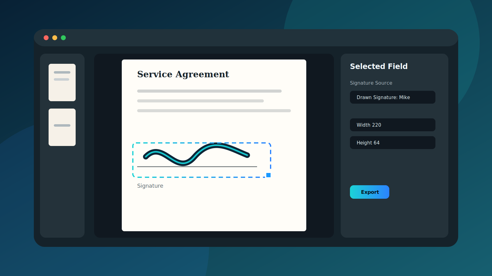
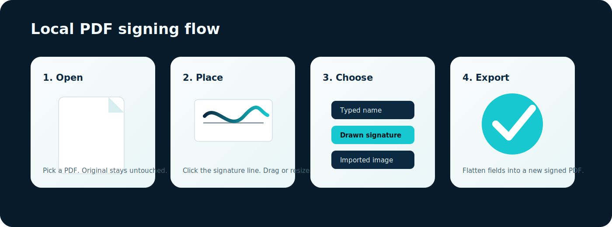
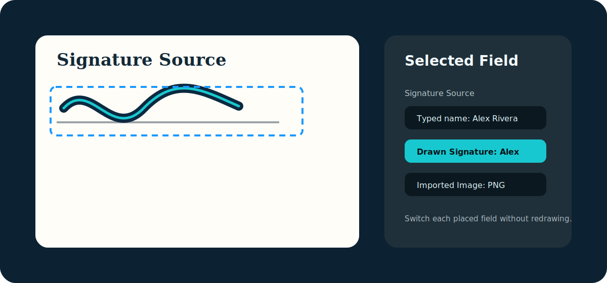
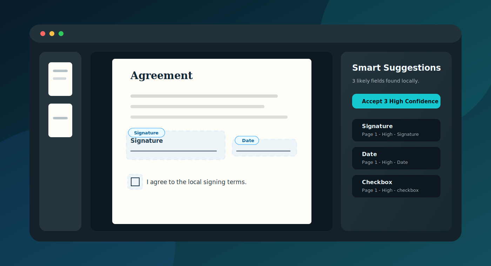
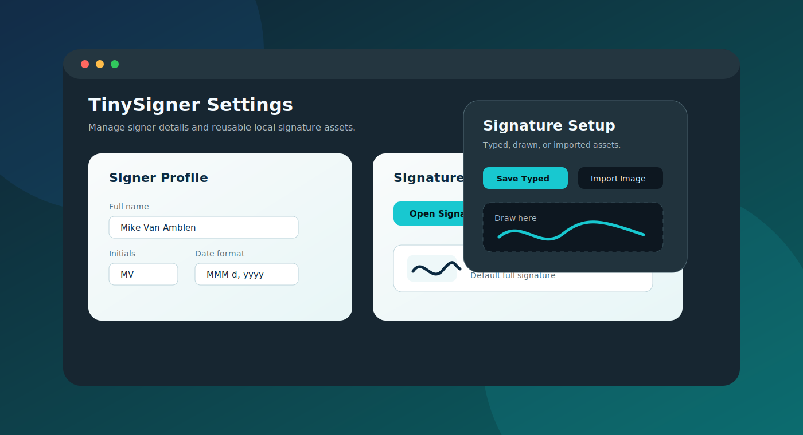
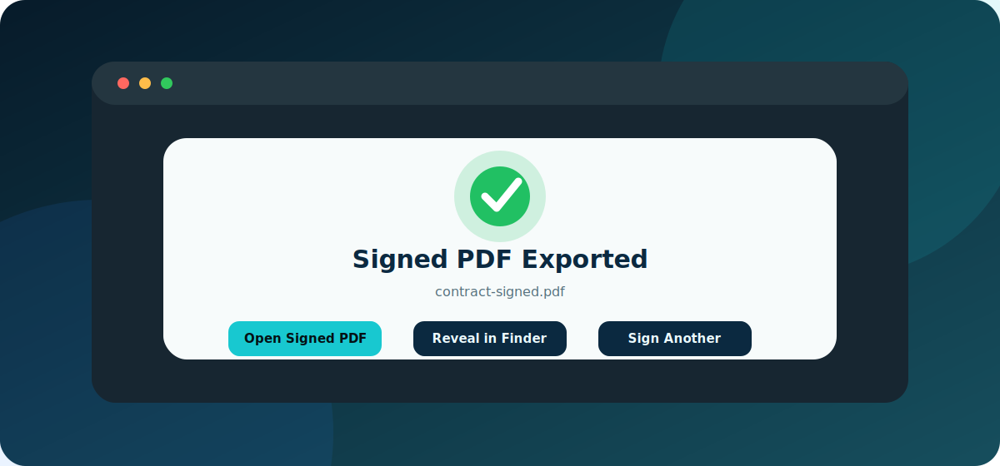
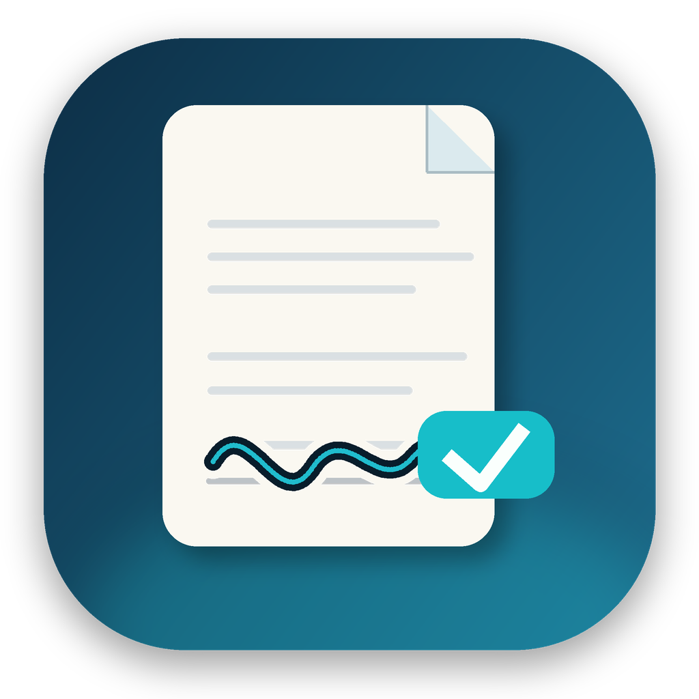
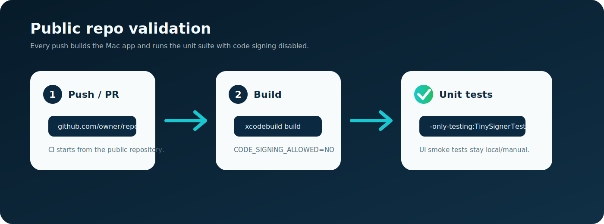

# TinySigner



TinySigner is a local-first macOS PDF e-signing app for quickly opening a PDF, placing visual signature/form fields, and exporting a new flattened signed copy. It is designed for practical day-to-day signing without sending documents through a cloud signing service.

TinySigner v1 creates visual electronic signatures. It does not create cryptographic certificate signatures, remote recipient envelopes, audit trails, or DocuSign API envelopes.

## What It Does



- Opens local PDFs with PDFKit.
- Detects likely signature, initials, date, and checkbox fields with local PDF heuristics.
- Shows smart field suggestions as subtle ghost outlines that can be accepted individually or in one high-confidence pass.
- Lets you place signatures, initials, text, dates, and checkboxes on any page.
- Supports typed signatures, drawn signatures, imported signature images, and initials.
- Stores signer profile and reusable signature assets locally with SwiftData.
- Provides a native Settings window for signer profile, date format, and reusable signature defaults.
- Provides page thumbnails, zoom controls, selection outlines, drag/resize handles, undo/redo, and keyboard delete.
- Exports a new flattened `*-signed.pdf` while leaving the original PDF untouched.

## Screens And Source Picker



When a signature or initials field is selected, use **Signature Source** in the inspector to switch that placed field between:

- Typed name or initials from the field value.
- Saved drawn signature.
- Imported image signature.

Profile setup and reusable signature creation live in **TinySigner > Settings** so the editor inspector can stay focused on the active document.

## Smart Suggestions



TinySigner scans searchable PDF text and rendered page geometry locally to find likely signing fields. Suggestions remain reversible ghost outlines until you click one or choose **Accept High Confidence**.

## Settings And Export



Signer profile, date format, default signature assets, and reusable signature setup live in the native Settings window.



After export, TinySigner confirms the flattened copy and offers quick actions to open it, reveal it in Finder, or sign another PDF.

## App Icon



The macOS app icon is committed in `TinySigner/Assets.xcassets/AppIcon.appiconset`. To regenerate the PNG renditions after changing the icon design:

```bash
# Pillow is only needed for regeneration; the generated PNGs are committed.
python3 -m pip install Pillow
python3 script/generate_app_icon.py
```

## Requirements

- macOS 26.2 or newer deployment target.
- Xcode 26.3 or newer.
- SwiftUI, PDFKit, SwiftData, and AppKit interop.

## Quick Start

```bash
open TinySigner.xcodeproj
```

Or build and launch from the terminal:

```bash
./script/build_and_run.sh --verify
```

Run unit tests:

```bash
xcodebuild test \
  -project TinySigner.xcodeproj \
  -scheme TinySigner \
  -destination 'platform=macOS' \
  -only-testing:TinySignerTests \
  CODE_SIGNING_ALLOWED=NO
```

Run UI smoke tests:

```bash
xcodebuild test \
  -project TinySigner.xcodeproj \
  -scheme TinySigner \
  -destination 'platform=macOS' \
  -only-testing:TinySignerUITests \
  CODE_SIGNING_ALLOWED=NO
```

GitHub Actions runs the app build and unit suite with code signing disabled. UI tests are kept as local smoke tests because macOS runner UI availability can be less predictable.



## User Flow

1. Open TinySigner.
2. Click **Open PDF** and choose a local PDF.
3. Choose a tool in the inspector: Signature, Initials, Text, Date, or Checkbox.
4. Review smart suggestions in the PDF overlay or inspector. Click one to accept it, or accept all high-confidence suggestions.
5. Click the PDF where a remaining field should go. Compatible tools snap to nearby smart suggestions.
6. Drag, resize, or delete the selected field as needed.
7. Pick a signature source for signature/initial fields.
8. Export a flattened signed PDF. The original file is not modified, and TinySigner offers to open the result, reveal it in Finder, or start another signing flow.

See [User Guide](docs/USER_GUIDE.md) for the full walkthrough.

## Project Layout

```text
TinySigner/
  Models/      SwiftData models and placed field data structures
  Services/    PDF opening/export and rendering services
  Stores/      Editor state, undo/redo, placement logic
  Views/       SwiftUI and PDFKit/AppKit bridge views
  Assets.xcassets/AppIcon.appiconset/

docs/
  USER_GUIDE.md
  DEVELOPMENT.md
  PRIVACY.md
  RELEASE_CHECKLIST.md
  images/      SVG documentation graphics and app icon preview

script/
  build_and_run.sh
  generate_app_icon.py
```

## Documentation

- [User Guide](docs/USER_GUIDE.md)
- [Development Notes](docs/DEVELOPMENT.md)
- [Privacy And Signature Scope](docs/PRIVACY.md)
- [Release Checklist](docs/RELEASE_CHECKLIST.md)
- [Changelog](CHANGELOG.md)
- [Contributing](CONTRIBUTING.md)
- [Security](SECURITY.md)

## Current Scope

TinySigner v1 is intentionally local and simple. It is a strong fit for signing your own PDF forms, contracts, acknowledgements, and internal documents. It is not intended to replace legally managed envelope workflows that require identity verification, tamper-evident certificate signatures, recipient routing, or third-party audit logs.

## License / Use

TinySigner is open source software released under the MIT License. See [LICENSE.md](LICENSE.md).
