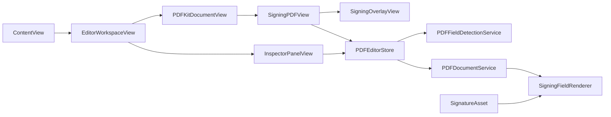

# Development Notes

TinySigner is a macOS SwiftUI app with a small AppKit/PDFKit bridge for document rendering and hit testing.

## Architecture



## Key Components

- `PDFEditorStore`: editor state, selected field, smart suggestions, undo/redo, placement defaults, zoom, and export command wiring.
- `PDFFieldDetectionService`: local heuristic detector for searchable labels, line geometry, and checkbox outlines.
- `PDFDocumentService`: PDF open/export, bookmark helpers, demo fixture generation, and flattened PDF rendering.
- `SigningFieldRenderer`: shared field renderer used by both live preview and exported PDFs.
- `PDFKitDocumentView`: SwiftUI wrapper around the PDFKit/AppKit editor surface.
- `SigningOverlayView`: transparent live preview layer. This avoids mutating the PDF document during drag.
- `InspectorPanelView`: tool picker, smart suggestions, and selected field inspector.
- `SettingsView`: signer profile, default assets, and reusable signature setup.

## Coordinate Model

Placed fields store `rectInPageSpace` in PDF page coordinates. The live overlay converts page-space rects into view-space rects for preview rendering. Export uses the original page-space rects directly while rendering each PDF page.

This is important because it keeps field placement stable across:

- Zoom changes.
- Scrolling.
- Page thumbnail navigation.
- Export flattening.

## Live Preview Rendering

Interactive previews should not be PDF annotations. Earlier annotation-based previews caused repeated stamp rendering when dragging. The current design draws fields in `SigningOverlayView`, keeping the document model clean until export.

Smart suggestions also render in `SigningOverlayView`, but remain separate from `PlacedField` until explicitly accepted. This keeps heuristic detection reversible and prevents suggestions from exporting accidentally.

## Smart Detection


Detection is intentionally heuristic and local-only:

1. Extract searchable PDF text labels from each `PDFPage`.
2. Render each page to a bitmap.
3. Detect long horizontal line geometry near signature/date/initial labels.
4. Detect square checkbox outlines from connected dark pixel components.
5. Mark label-plus-line and checkbox geometry as high confidence; label-only suggestions stay medium confidence.

The app only auto-creates fields when the user accepts high-confidence suggestions. Medium-confidence suggestions require an explicit click.

## Settings And Profile


Signer identity and reusable signature assets live in `SettingsView` and `SignatureSetupSheet`. The editor inspector stays document-focused: tools, smart suggestions, selected field values, and signature source selection for the selected field.

Profile and asset persistence use SwiftData models:

- `SignerProfile`: full name, initials, preferred date format, default asset IDs.
- `SignatureAsset`: typed, drawn, imported, or initials asset data.
- `RecentDocument`: security-scoped bookmark data for reopened PDFs.

## Export Rendering


Export follows this sequence:

1. Remove any TinySigner preview annotations from the document as a safety cleanup.
2. Create a new PDF context at the original page media box.
3. Draw each source PDF page.
4. Draw TinySigner fields assigned to that page.
5. Close the output PDF.

## Build

```bash
./script/build_and_run.sh --verify
```

## Tests

Focused unit tests:

```bash
xcodebuild test \
  -project TinySigner.xcodeproj \
  -scheme TinySigner \
  -destination 'platform=macOS' \
  -only-testing:TinySignerTests \
  CODE_SIGNING_ALLOWED=NO
```

UI smoke tests:

```bash
xcodebuild test \
  -project TinySigner.xcodeproj \
  -scheme TinySigner \
  -destination 'platform=macOS' \
  -only-testing:TinySignerUITests \
  CODE_SIGNING_ALLOWED=NO
```

## CI


`.github/workflows/ci.yml` runs `xcodebuild build` and `TinySignerTests` on `macos-latest` with `CODE_SIGNING_ALLOWED=NO`. UI smoke tests are documented and kept local because hosted macOS UI automation can be less predictable than unit-level validation.

## Visual Assets

The app icon is generated into `TinySigner/Assets.xcassets/AppIcon.appiconset`.

```bash
python3 -m pip install Pillow
python3 script/generate_app_icon.py
```

Documentation graphics live in `docs/images`. SVGs are committed as source so they remain easy to review and tweak.

## Implementation Guardrails

- Do not mutate the source PDF during live editing.
- Keep placement rectangles in page coordinates.
- Keep exports flattened and original PDFs unchanged.
- Keep suggestions separate from real fields until accepted.
- Keep signature assets local.
- Use PDFKit/AppKit bridge code only where SwiftUI cannot model the behavior cleanly.
